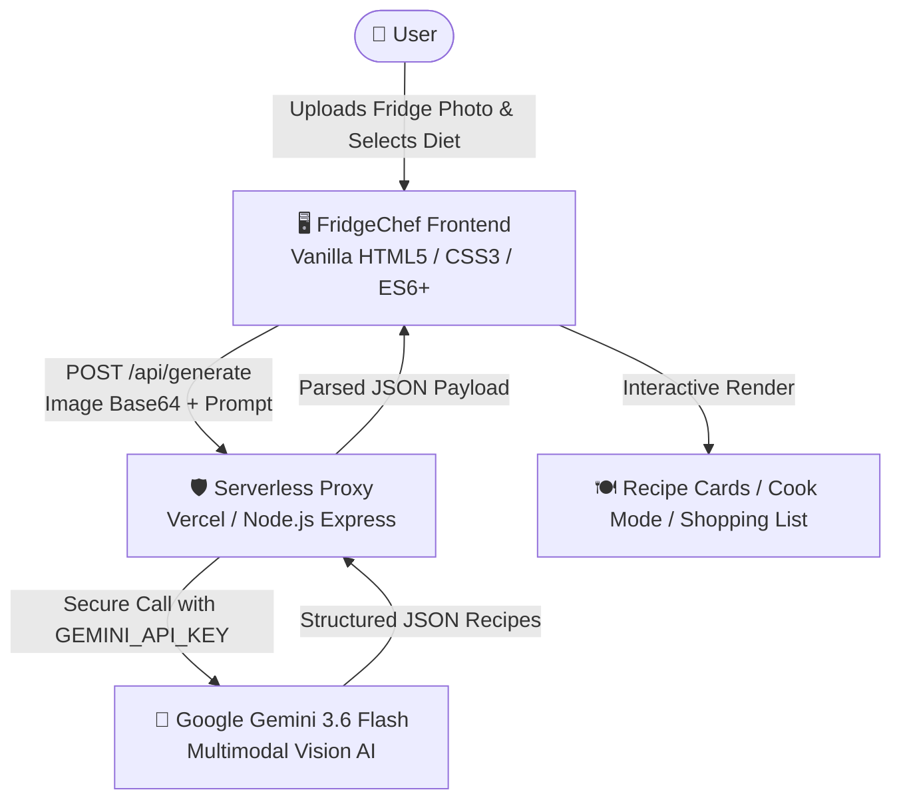

# 🍳 FridgeChef — AI-Powered Recipe Generator

<p align="center">
  
  
  
  
  
  
</p>

<p align="center">
  <strong>Turn leftover fridge ingredients into delicious, chef-curated meals in seconds using Google Gemini Multimodal Vision AI.</strong>
</p>

---

## 📑 Table of Contents

- [📖 Overview](#-overview)
- [✨ Features](#-features)
  - [📸 Visual Ingredient Recognition](#-visual-ingredient-recognition)
  - [🧑‍🍳 Fullscreen Kitchen & Cook Mode](#-fullscreen-kitchen--cook-mode)
  - [⚖️ Dynamic Servings Scaler](#️-dynamic-servings-scaler)
  - [✨ AI Recipe Tweaking](#-ai-recipe-tweaking)
  - [🔄 Smart Culinary Substitutions](#-smart-culinary-substitutions)
  - [🛒 Grocery Shopping List](#-grocery-shopping-list)
  - [🥦 Dietary & Lifestyle Filters](#-dietary--lifestyle-filters)
  - [🖨️ Ink-Friendly Print & Web Share](#️-ink-friendly-print--web-share)
- [⌨️ Keyboard Shortcuts](#️-keyboard-shortcuts)
- [🏗️ System Architecture](#️-system-architecture)
- [🛠️ Tech Stack](#️-tech-stack)
- [📁 Repository Structure](#-repository-structure)
- [🚀 Quick Start (Local Setup)](#-quick-start-local-setup)
- [📡 API Reference](#-api-reference)
- [🌐 Deployment Guide](#-deployment-guide)
- [⚙️ Environment Variables](#️-environment-variables)
- [🤝 Contributing](#-contributing)
- [🗺️ Roadmap](#️-roadmap)
- [📄 License](#-license)
- [👨‍💻 Author](#-author)

---

## 📖 Overview

**FridgeChef** is an intelligent full-stack web application designed to minimize food waste and eliminate the daily headache of *"What should I cook today?"*. 

Simply take or upload a photo of your refrigerator, pantry shelves, or grocery haul. **Google Gemini Vision AI** scans and identifies visible ingredients, combines them with your preferred staples, and crafts 3 gourmet, chef-calibrated recipes tailored to your dietary goals—complete with step-by-step instructions, interactive cooking timers, and macronutrient breakdowns.

---

## ✨ Features

### 📸 Visual Ingredient Recognition
- **Multimodal AI Scanning**: Drag & drop or upload any fridge or pantry photo. Gemini analyzes images directly to identify produce, dairy, proteins, and condiments.
- **Pantry Staples Integration**: Toggle everyday essentials (*Salt, Black Pepper, Olive Oil, Garlic, Butter, Soy Sauce, etc.*) so recipes make natural use of basics you already have without extra grocery trips.

### 🧑‍🍳 Fullscreen Kitchen & Cook Mode
- **Distraction-Free Cooking View**: Focused, high-contrast modal presenting one instruction step at a time with large, easy-to-read typography.
- **Smart Auto-Detected Timers**: Automatically parses durations from steps (e.g., *"simmer for 10 minutes"*) into interactive countdown timers.
- **Audio Chime Notification**: Plays a pleasant synthesizer chime via the Web Audio API when countdown timers finish.
- **Hands-Free Voice Assistant (TTS)**: Built-in Text-to-Speech via the browser's Web Speech API to read instructions aloud while your hands are busy cooking.

### ⚖️ Dynamic Servings Scaler
- **Instant Portion Adjustment**: Toggle between `1x`, `2x` (default), `4x`, and `6x` servings on any recipe card.
- **Mathematical Fraction Recalculation**: Dynamically recalculates fractional ingredient measurements (e.g. `1/2 cup` ➔ `1 cup` ➔ `2 cups`) and nutritional macros (*Calories, Protein, Carbs*) in real time.

### ✨ AI Recipe Tweaking
- **One-Click Culinary Presets**: Instantly refine any recipe with targeted modifiers:
  - 🔥 *Extra Spicy*
  - ⚡ *Under 400 Kcal*
  - 🍟 *Air Fryer Style*
  - 🌿 *Low Sodium*
  - ⏱️ *15-Min Express*
  - 🧀 *Extra Cheesy*
  - 🌱 *Plant-Based*
- **Custom Prompt Tweaks**: Enter custom instructions (*e.g., "Replace cream with oat milk and make it crispy"*) to have Gemini regenerate the dish in-place.

### 🔄 Smart Culinary Substitutions
- **Curated Alternatives Database**: Searchable guide of 18+ common culinary substitutes with exact substitution ratios and chef notes (e.g. Buttermilk, Heavy Cream, Eggs, Soy Sauce, Cornstarch).

### 🛒 Grocery Shopping List
- **1-Click Missing Ingredients**: Export any recipe's ingredients into a dedicated shopping checklist with persistent `localStorage` storage.
- **Actionable Sharing**:
  - 📋 **Copy to Clipboard**: Clean markdown checklist formatting.
  - 💬 **WhatsApp Export**: 1-click sharing pre-filled for grocery runs.
  - 🛒 **Online Ordering**: Quick-link to search items directly on Amazon Fresh.

### 🥦 Dietary & Lifestyle Filters
- Tailor suggestions with a single click:
  - **Any** (Balanced / No restrictions)
  - 🥦 **Vegetarian**
  - 🌱 **Vegan**
  - 🥩 **Keto**
  - 🌾 **Gluten-Free**
  - 🥛 **Dairy-Free**
  - 💪 **High-Protein** (30g+ protein target)
  - 🥑 **Low-Carb** (<20g net carbs)

### 🖨️ Ink-Friendly Print & Web Share
- **Clean Physical Recipe Cards**: Dedicated `@media print` CSS formats recipes into crisp black-and-white printable cards with checkboxes for kitchen use.
- **Native Web Share**: Share recipes directly across mobile devices via `navigator.share()`.

---

## ⌨️ Keyboard Shortcuts

| Shortcut | Context | Action |
|---|---|---|
| `→` (Right Arrow) | Kitchen Cook Mode | Next step |
| `←` (Left Arrow) | Kitchen Cook Mode | Previous step |
| `Space` | Kitchen Cook Mode | Start / Pause cooking timer |
| `Esc` | Anywhere | Dismiss open modals / Exit Cook Mode |

---

## 🏗️ System Architecture



---

## 🛠️ Tech Stack

### **Frontend**
- **Core**: Vanilla HTML5, Modern CSS3 with Design Tokens & Glassmorphism, Vanilla ES6+ JavaScript.
- **Web APIs**: Web Speech API (TTS), Web Audio API (Timer Chimes), Web Share API (`navigator.share`), FileReader API, Canvas & Drag-and-Drop.
- **Typography**: Google Fonts ([Playfair Display](https://fonts.google.com/specimen/Playfair+Display) & [Inter](https://fonts.google.com/specimen/Inter)).
- **Hosting**: Firebase Hosting (`fridgechef-f9f87`).

### **Backend & AI**
- **Runtime**: Node.js, Express.js (local development).
- **Serverless**: Vercel Serverless Functions (`/api/generate`, `/api/health`).
- **AI Engine**: [Google Gemini 3.6 Flash](https://aistudio.google.com/) via Google Generative Language API (`gemini-3.6-flash:generateContent`).
- **Middleware**: CORS, Body Parser (50MB base64 image payload support), Dotenv.

---

## 📁 Repository Structure

```plaintext
Recipe-Gen/
├── api/                        # Root Vercel Serverless entry points
│   ├── generate.js             # Proxies /api/generate
│   └── health.js               # Proxies /api/health
├── backend/                    # Backend server and Vercel functions
│   ├── api/
│   │   ├── generate.js         # Gemini Vision wrapper handler
│   │   └── health.js           # API health status check
│   ├── .env.example            # Backend environment variables template
│   ├── package.json            # Backend dependencies & scripts
│   ├── server.js               # Express development server
│   ├── vercel.json             # Vercel serverless configuration
│   └── README.md               # Backend-specific documentation
├── index.html                  # Main application frontend
├── style.css                   # Custom modern styles & design tokens
├── script.js                   # Application state, UI handlers, API client
├── firebase.json               # Firebase Hosting configuration
├── .firebaserc                 # Firebase project target
├── package.json                # Root package configuration
├── vercel.json                 # Root deployment routing & CORS headers
└── README.md                   # Project documentation
```

---

## 🚀 Quick Start (Local Setup)

### Prerequisites
- [Node.js](https://nodejs.org/) (v18 or higher recommended)
- [Google Gemini API Key](https://aistudio.google.com/) (Free tier available)

---

### 1. Clone the Repository
```bash
git clone https://github.com/krishnakant09/Recipe-Gen.git
cd Recipe-Gen
```

### 2. Configure Environment Variables
Create a `.env` file in the root directory or in `backend/`:

```bash
cp backend/.env.example backend/.env
```

Add your Gemini API Key:
```env
GEMINI_API_KEY=your_gemini_api_key_here
PORT=5000
GEMINI_MODEL=gemini-3.6-flash
```

### 3. Install Dependencies
```bash
# Install root dependencies
npm install

# Install backend dependencies
cd backend && npm install && cd ..
```

### 4. Run Locally

#### Terminal 1 — Start the Backend Server:
```bash
npm run server
# Server runs at http://localhost:5000
```

#### Terminal 2 — Serve the Frontend:
```bash
npm run dev
# Frontend runs at http://localhost:3000
```

Open your browser and navigate to `http://localhost:3000`.

---

## 📡 API Reference

The backend exposes two primary endpoints:

### `GET /api/health`
Checks whether the serverless API is online and whether `GEMINI_API_KEY` is configured.

**Response:**
```json
{
  "status": "ok",
  "hasApiKeyConfigured": true,
  "model": "gemini-3.6-flash",
  "timestamp": "2026-09-15T16:52:00.000Z"
}
```

---

### `POST /api/generate`
Generates ingredient analysis and structured recipe recommendations from an image or custom prompt.

#### Headers
| Header | Value | Description |
|---|---|---|
| `Content-Type` | `application/json` | Required |
| `x-api-key` | `string` | *(Optional)* Override backend API key with custom key |

#### Request Body (Standard Gemini Format)
```json
{
  "contents": [
    {
      "parts": [
        {
          "inline_data": {
            "mime_type": "image/jpeg",
            "data": "<BASE64_IMAGE_DATA>"
          }
        },
        {
          "text": "Analyze this fridge photo and generate 3 recipes..."
        }
      ]
    }
  ],
  "generationConfig": {
    "temperature": 0.7,
    "maxOutputTokens": 2048
  }
}
```

---

## 🌐 Deployment Guide

### Deploy Backend to Vercel
1. Push your code to GitHub.
2. Import your repository in [Vercel](https://vercel.com).
3. In your project settings, add the Environment Variable:
   - **Name**: `GEMINI_API_KEY`
   - **Value**: Your Google Gemini API Key
4. Deploy! Your backend API will be available at `https://<your-project>.vercel.app/api/generate`.

### Deploy Frontend to Firebase Hosting
1. Ensure Firebase CLI is installed and authenticated:
   ```bash
   npx firebase-tools login
   ```
2. Deploy the static frontend:
   ```bash
   npm run deploy
   ```

---

## ⚙️ Environment Variables

| Variable | Description | Default |
|---|---|---|
| `GEMINI_API_KEY` | Your Google Gemini API key from Google AI Studio | *Required* |
| `PORT` | Local development port for Express server | `5000` |
| `GEMINI_MODEL` | Gemini AI model version used for generation | `gemini-3.6-flash` |

---

## 🤝 Contributing

Contributions, bug reports, and feature requests are welcome! To contribute:

1. **Fork the Project** (`https://github.com/krishnakant09/Recipe-Gen/fork`)
2. **Create your Feature Branch**:
   ```bash
   git checkout -b feature/AmazingFeature
   ```
3. **Commit your Changes**:
   ```bash
   git commit -m "feat: Add AmazingFeature with interactive preview"
   ```
4. **Push to the Branch**:
   ```bash
   git push origin feature/AmazingFeature
   ```
5. **Open a Pull Request** describing your changes in detail.

---

## 🗺️ Roadmap

- [ ] 📱 PWA (Progressive Web App) offline support for saved recipes.
- [ ] 📸 Multi-angle image capture (e.g. Fridge + Freezer + Pantry simultaneously).
- [ ] 🥗 Barcode scanner for scanning packaged pantry goods.
- [ ] 📅 7-Day Meal Planner calendar based on saved inventory.
- [ ] 🌐 Internationalization (i18n) for multilingual recipe generation.

---

## 📄 License

This project is licensed under the MIT License — see the [LICENSE](LICENSE) file for details.

---

## 👨‍💻 Author

**Krishnakant (KK)**
- GitHub: [@krishnakant09](https://github.com/krishnakant09)
- Repository: [Recipe-Gen](https://github.com/krishnakant09/Recipe-Gen)

<p align="center">Made with ❤️ and Google Gemini AI</p>
